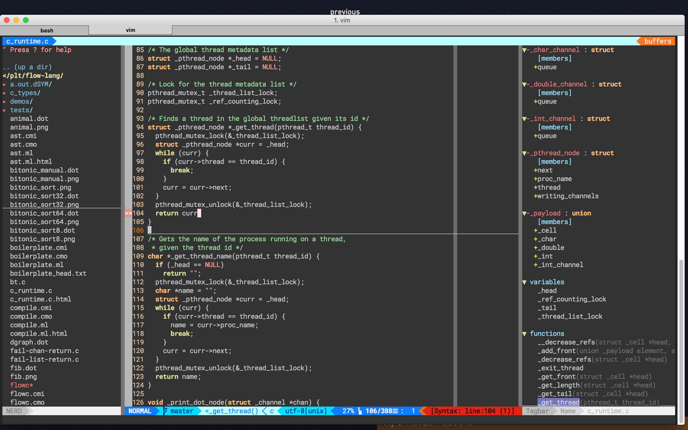

# Introduction
I've had my vim configs running amok for years - outdated plugins, mappings
endlessly stomping on each other, and random cargo-cult functions performing
terrible deeds. Here is my attempt to fix this sad state of affairs. I realize
that my configs might be of use to those who are new to Vim, so I've made them
publicly available.

I do not view myself as a seasoned vim user. I understand the basic paradigms,
but I've never gotten around to scripting my own plugins. Please excuse any
conventions that I might have (read: probably) broken, and feel free to submit
pull requests to fix this repo up - I would highly appreciate that.

Below is a picture of my Vim setup. Note the file system on the left (nerdtree
plugin) error detection on line 184 (syntastic), tags on the right (tagbar),
and statusline packed with useful info (airline). If these things appeal to
you, follow along and I'll explain how to install and subsequently *use* this
setup. It might take some work to get used to, but it is definitely worth it
if you plan to use Vim in the long term.

# Installation
I plan to write a *real* installation guide in the future. In the meantime, do
not, I repeat DO NOT run any commands in this repo without first understanding
what they do. There is stuff in here that will destroy all of your current vim
configs, so understand all scripts before running them.
