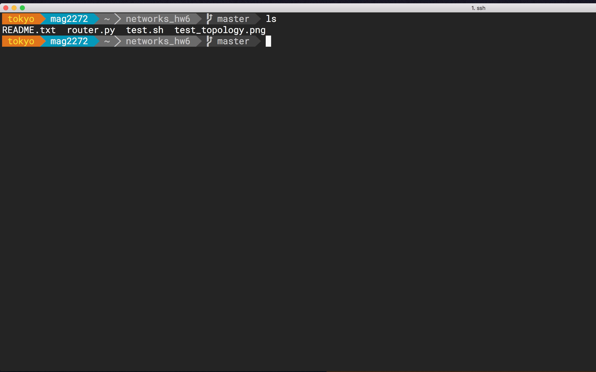

# Introduction
I've had my vim configs running amok for years - outdated plugins, mappings
endlessly stomping on each other, and random cargo-cult functions performing
terrible deeds. Here is my attempt to fix this sad state of affairs. I realize
that my configs might be of use to those who are new to Vim, so I've made them
publicly available.

I do not view myself as a seasoned vim user. I understand the basic paradigms,
but I've never gotten around to scripting my own plugins. Please excuse any
conventions that I might have (read: probably) broken, and feel free to submit
pull requests to fix this repo up - I would highly appreciate that.

Below is a picture of my Vim setup. Note the file system on the left (nerdtree
plugin) error detection on line 184 (syntastic), tags on the right (tagbar),
and statusline packed with useful info (airline). If these things appeal to
you, follow along and I'll explain how to install and subsequently *use* this
setup. It might take some work to get used to, but it is definitely worth it
if you plan to use Vim in the long term.

# Installation

## Base installation of vimrc and all packages
The installation script in this repo does a few things. Make sure you have a
basic understanding of all of them before proceeding:

1. It installs Vundle, a package manager. I'll touch more on this later.
2. It uses Vundle to install the packages specified in vimrc.
3. It appends the `index` alias to your .bash\_profile. This alias is a
   convenience command for invoking ctags (I will cover this later).

### All Vim versions

## Preparation
Before you install, you need to make sure that you've gotten rid of your ~/.vim
directory and your ~/.vimrc, or at least put those files somewhere safe.

    $ git clone https://github.com/mgouzenko/vimconfig ~/.vim
	$ cd ~/.vim
	$ ./install.sh

### Vim versions < 7.4
If your Vim version is 7.3.X, some plugins won't work. To disable those plugins,
comment out the relevant 'Plugin' line in vimrc.

In addition, Vim versions under 7.4 don't check .vim/vimrc for your vimrc file.
You have to put the following line in your ~/.vimrc:

    runtime vimrc

## Install Powerline Fonts
Some packages, like airline, use powerline. Powerline is a statusline plugin for
VIM and bash, and other applications. To get powerline to render properly,
you have install powerline and powerline fonts on your system. This
is a separate section because this actually has nothing to do with your
vim setup. Because this requires some manual configuration, I haven't
included it in the installation script.

### Steps to Install Powerline
Install powerline as specified
[here](https://powerline.readthedocs.io/en/latest/installation.html#pip-installation).
Then, install some powerline fonts on your system, as specified
[here](https://github.com/powerline/fonts) Finally - and this depends on what
emulator you use - set the terminal emulator's font to one of the powerline
fonts that you just installed.

## Install a Cool Bash Prompt
The normal bash prompt is boring and not particularly smart. Fortunately,
the vim promptline plugin helps to generate a really cool bash prompt.

The generated prompt can be configured to do many things, but these are the
most important for me personally:

1. **Smart directory listing:** the prompt calculates how deep you are in your
file system, and abbreviates the path so that it doesn't get too long.
2. **Git branch:** if you're in a git repo, the prompt tells you which branch
you're on.
3. **Hostname:** The promptline lists the hostname, but only if you've ssh'ed
into the machine.

To get a basic promptline going, you need powerline. Once you have that installed
properly, you can run the following script to generate and install a better promptline:

    $ ./install_promptline.sh

Then, source your `~/.bash_profile` for the change to take effect:

    $ source ~/.bash_profile

This script generates a promptline and stores it in ~/.promptline.sh. Then, it adds
a line to your `.bash_profile` to source the generated promptline.

